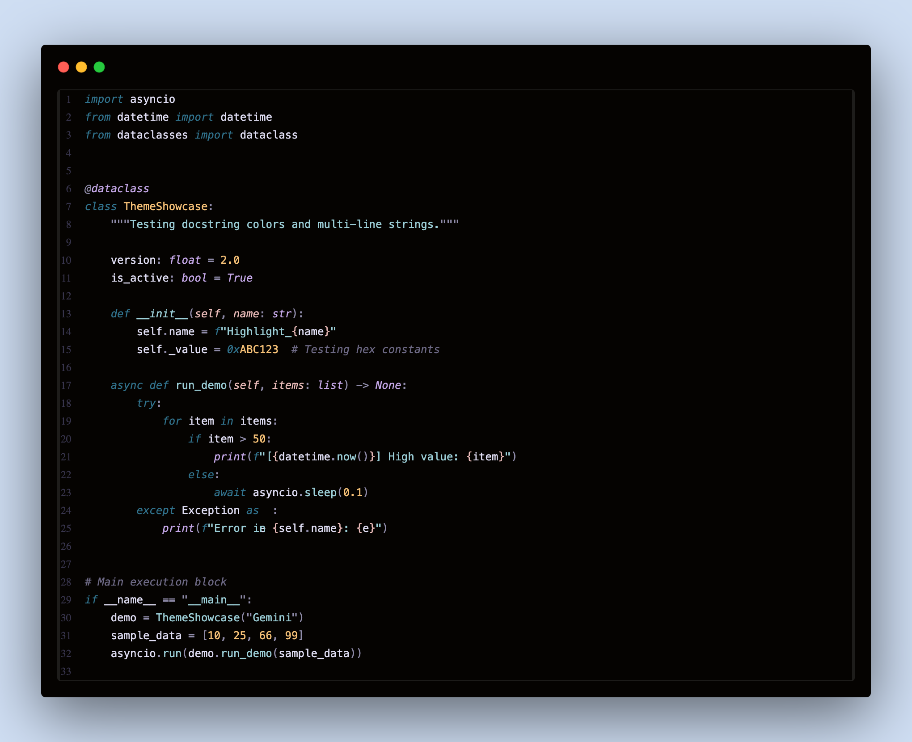

 

 
 

# 🪶 Raven

**A darker variant of [Rosé Pine](https://rosepinetheme.com/) for Visual Studio Code.**

*Deep as midnight. Warm as embers.*

 

---

## ✦ About

**Raven** takes the beloved warmth of Rosé Pine and pushes it into deeper shadow — a theme for those who write code at 2am, for editors that should feel like a cockpit, not a café. The blacks are true, the purples are royal, and every color earns its place against the dark.

---

## 🎨 Palette

| Role | Hex | Preview |
|:-----|:----|:-------:|
| Background | `#050301` |  |
| Surface | `#0d0b12` |  |
| Overlay | `#181526` |  |
| Muted | `#6e6a86` |  |
| Subtle | `#908caa` |  |
| Text | `#e0def4` |  |
| Love | `#eb6f92` |  |
| Gold | `#f6c177` |  |
| Rose | `#ebbcba` |  |
| Pine | `#31748f` |  |
| Foam | `#9ccfd8` |  |
| Iris | `#c4a7e7` |  |

---

## 📦 Installation

**Via VS Code Marketplace** *(recommended)*

1. Open VS Code
2. Press `Ctrl+Shift+X` to open Extensions
3. Search for **Raven**
4. Click **Install**
5. Open the Command Palette with `Ctrl+Shift+P`
6. Type `Preferences: Color Theme` and select **Raven**

---

## 🗂️ File Language Support

Raven has been carefully tuned for the following languages:

- **JavaScript / TypeScript** — JSX, TSX, Node
- **Python** — type hints, decorators, f-strings
- **Rust** — lifetimes, macros, pattern matching
- **Go** — interfaces, goroutines
- **HTML / CSS / SCSS**
- **JSON / YAML / TOML**
- **Markdown** — headers, inline code, links
- **Shell / Bash**

> If you notice something off in your language of choice, feel free to [open an issue](../../issues).

---

## 🙏 Credits

Built on the [Rosé Pine](https://rosepinetheme.com/) color system by [Emilia Dunfelt](https://github.com/emilydotgg). Raven is a spiritual extension — darker, quieter, colder — of that original vision.

---

**If Raven lights up your editor, consider supporting the work.**

 

*Made with ☕ and a deep appreciation for the dark.*

